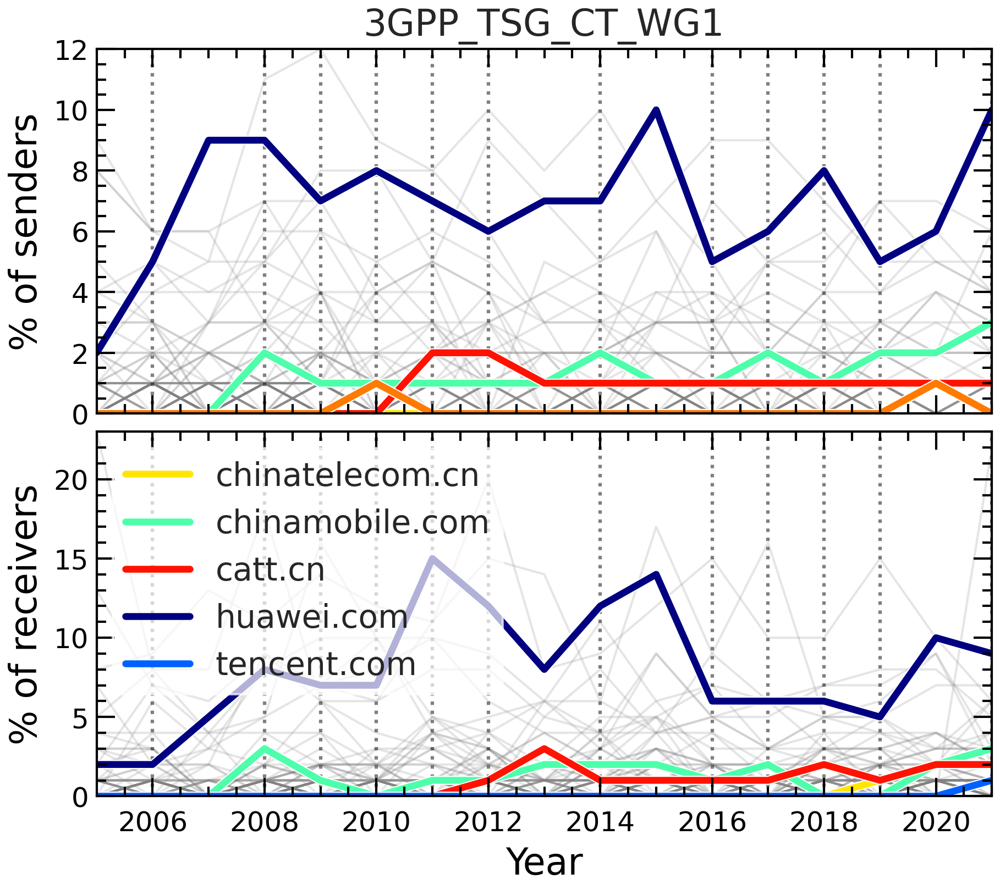

Lines
=====

To help visualise, e.g., time-series data obtained through :ref:`3GPP <time_series>`,
we provide a number of support functions. If, for example, one has executed the
``mlist.get_localpartscount()`` command with ``per_year=True``, one can use
``lines.evolution_of_participation_1D()`` to visualise how the number of get_localparts
changed over time for each domain, which is related to the number of participants
belonging to each organisation:

.. code-block:: python

    from bigbang.analysis.listserv import ListservMailList
    from bigbang.visualisation import graphs

    mlist_name = "3GPP_TSG_SA_WG3_LI"
    filepath = f"/home/christovis/InternetGov/bigbang-archives/3GPP/{mlist_name}.mbox"
    mlist = ListservMailList.from_mbox(
        name=mlist_name,
        filepath=filepath,
    )

    dic = mlist.get_localpartscount(
        header_fields=['from'],
        per_domain=True,
        per_year=True,
    )

    entities_in_focus = [
        'catt.cn',
        'chinaunicom.cn',
        'huawei.com',
        'chinatelecom.cn',
        'chinamobile.com',
    ]

    fig, axis = plt.subplots()
    lines.evolution_of_participation_1D(
        dic['from'],
        ax=axis,
        entity_in_focus=entities_in_focus,
        percentage=False,
    )
    axis.set_xlabel('Year')
    axis.set_ylabel('Nr of senders')

The above code produces the following figure:

Alternatively it can also be visualised as a heat map using
``lines.evolution_of_participation_2D()``. Similarly, one can plot the evolution
of, e.g., different types of centrality of domain names in the communication network:

.. code-block:: python

    from bigbang.analysis.listserv import ListservMailList
    from bigbang.visualisation import graphs

    dic = mlist.get_graph_prop_per_domain_per_year(func=nx.degree_centrality)

    fig, axis = plt.subplots()
    lines.evolution_of_graph_property_by_domain(
        dic,
        "year",
        "degree_centrality",
        entity_in_focus=entities_in_focus,
        ax=axis,
    )
    axis.set_xlabel('Year')
    axis.set_ylabel(r'$C_{\rm D}$')
